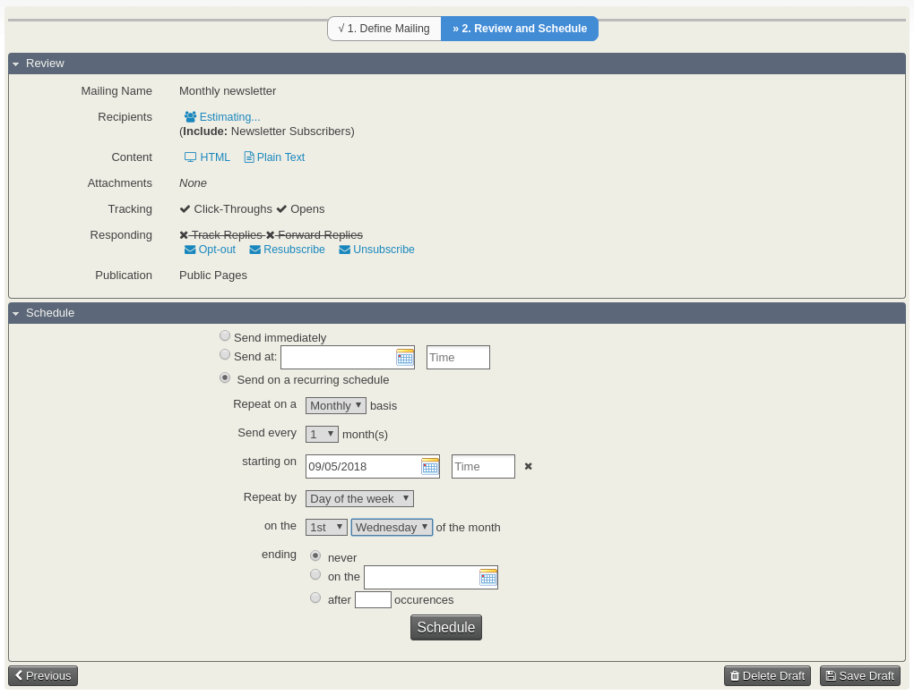
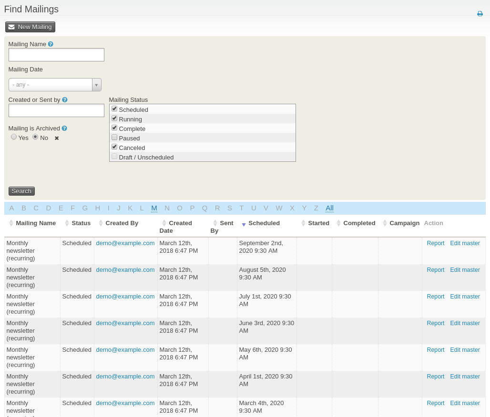

# CiviCRM Recurring mail

Lets you configure CiviCRM mailings to be sent on a recurring schedule.

## Requirements

CiviCRM 4.7

## Installation

1. Download a release from https://github.com/3sd/civicrm-recurring-mail/releases to your extensions directory
2. Browse to **Administer > System Settings > Extensions**
3. Find **Recurring mail** and click **Install**

## Getting started

Install the extension and compose your mail as normal. On the **Review and Schedule** screen, you will see a third option **Send on a recurring schedule**. Selecting this option will reveal a set of fields where you can defined the recurrence schedule.

Once you mailing is ready to send, click **Schedule** and instances of your recurring mailing will be scheduled to be sent out according to the schedule you defined.

You can edit the master mailing and adjust the recurrence schedule as necessary. All instances of the recurring mailing will be updated automatically.

**Note:** out-of-the-box, CiviCRM calculates the recipients for a mailing based on the contacts that are in your include/exclude groups/mailings at the time that you hit the submit button. This means that any contacts that are added or removed to your groups in the time between when you hit the submit button and the date it is scheduled to go out will not receive your mailing.  If you want your recipients to be recalculated before the mailing is sent you, you should install the [recalculate recipients extension](https://github.com/3sd/civicrm-recalculate-recipients).

## Help

If you have any questions regarding this extension that are not answered in this README, please check post a question on http://civicrm.stackexchange.com or contact info@thirdsectordesign.org.

## Credits

This extension has been generously funded by [eLife Sciences](https://elifesciences.org/), a unique, non-profit collaboration between the funders and practitioners of research to improve the way important results are presented and shared.

It has been written by [Michael McAndrew](https://twitter.com/michaelmcandrew) from [Third Sector Design](https://thirdsectordesign.org/) who you can [contact](https://thirdsectordesign.org/contact) for help, support and further development.

## Contributing

Contributions to this repository are very welcome. For small changes, feel free to submit a pull request. For larger changes, please create an issue first so we can talk about your ideas.

## License

This extension is licensed under [AGPL-3.0](LICENSE.txt).
